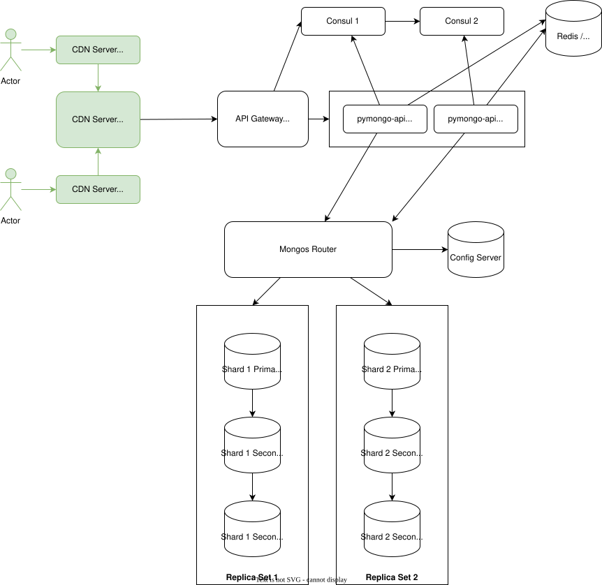

# Как запустить и проверить

## 0. Итоговая схема



## 1. Запустите приложение

Убедиться, что находишься в каталоге `sharding-repl-cache`

```shell
docker compose up -d
```

## 2. Инициализация

Инициализируем бд: настраиваем replica set для config-сервера, шардов **И РЕПЛИК** и подключаем их к маршрутизатору mongos

```shell
bash scripts/mongo-init.sh
```

## 3. Опрашиваем данные

Для запуска проверки выполнить скрипт.

> Примечание: перечень реплик зашит в скрипт, чтобы динамически обнаружить все реплики (контейнеры MongoDB, участвующие в шардинге), не зная их имён и портов заранее — нужно запрашивать информацию у самого кластера MongoDB.
> Так как это явно нге указано в задаче, то на этом этапе не делал.

```shell
bash scripts/check.sh
```

## 4. Провенряем кэширование

```shell
bash scripts/benchmark-api.sh
```

## 5. Приложение открывается в браузере и отображает JSON с информацией о MongoDB.
[ссылка на приложение](http://localhost:8080/)


---

## На случай перезапуска

```shell
docker compose down -v
```

И потом можно заново заполнять.